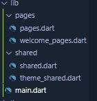
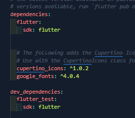
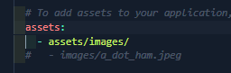

# UI-Design-Practice-Flutter-UTS

UI Design Practice Flutter UTS

This project is an assignment from my class
#### NAMA : Ravansa Rahman Santosa
#### NIM : 312110103
#### Kelas : TI.21.A2
#### MatKul : Pemrograman Mobile

### Hasil Pembuatan Login Page Di Flutter

### Pertama Pembuatan Package
Membuat package pages dan shared dan masing masing di buat file pages = pages.dart & welcome_pages.dart, shared = shared.dart & theme_shared.dart
### 
### Mencantumkan dependensi yang diperlukan oleh proyek Flutter. 
yaitu versi cupertino_icons ^1.0.2. Paket ini menyediakan font ikon Cupertino untuk ikon bergaya iOS di aplikasi Flutter. Selain itu, ada daftar dependensi google_fonts versi ^4.0.4, yang memungkinkan Anda untuk menggunakan font khusus dalam aplikasi.
### 
### 
Menambahkan jalur direktori Assets

### Membuat file shared dan theme_shared
theme_shared.dart code yang berguna menyimpan warna dan font
### code theme_shared.dart
```
part of 'shared.dart';

double defaultMargin =24;

Color primaryColor = Color.fromRGBO(78, 54, 231, 1);
Color secondaryColor = Color(0xFFf0f0f0);
Color blackColor = Color(0xff050522);

TextStyle blackTextStyle = GoogleFonts.roboto(fontSize: 36, color: blackColor, fontWeight: FontWeight.w500);
TextStyle secondaryTextStyle = GoogleFonts.poppins(fontSize: 14, color: blackColor, fontWeight: FontWeight.w500);
```
### code shared.dart
ketika menulis code file import otomatis ada di shared.dart karna shared adalah bagian dari theme_shared
```
import 'package:flutter/material.dart';
import 'package:google_fonts/google_fonts.dart';

part 'theme_shared.dart';
```
### Mengatur file main.dart
```
import 'package:flutter/material.dart';
import 'package:loginpage/pages/pages.dart';
import 'package:loginpage/shared/shared.dart';

void main() {
  runApp(MyApp());
}
class MyApp extends StatelessWidget {
  const MyApp({super.key});

  @override
  Widget build(BuildContext context) {
    return MaterialApp(debugShowCheckedModeBanner: false,
    theme: ThemeData(
      primarySwatch: Colors.cyan,
          primaryColor: primaryColor, 
          canvasColor: Colors.transparent),
    home: WellcomePage(),);
  }
}
```

### Membuat file pages.dart dan welcome_pages.dart

### welcome_pages.dart
Mengatur Background Color Aplikasi

```
class _WellcomePageState extends State<WellcomePage> {
 
  @override
  Widget build(BuildContext context) {
    return Scaffold(
      backgroundColor: primaryColor,
      body: SafeArea(
        bottom: false,
        child: Stack(
          children: [
            Positioned(
              top: -0,
              left: 0,
```
### Mengatur gambar awan biru di kiri atas layar
```
              child: Image.asset(
                'assets/images/awan.png',
                height: 300,
                width: 450,
              ),
            ),
            Center(
              child: Transform.translate(
                offset: Offset(0, -90),
                child: SizedBox(
                  height: 500,
```
### Mengatur logo di tengah aplikasi
```
                  
                  child: Image.asset(
                    'assets/images/Logo.png',
                    fit: BoxFit.fitHeight,
                  ),
                ),
              ),
            ),
```
### Code untuk Button Create Account dan Memunculkan Register
```
            Positioned(
              bottom: 160,
              left: defaultMargin,
              right: defaultMargin,
              child: Container(
                height: 60,
                child: ElevatedButton(
                  onPressed: () {
                    showModalBottomSheet(
                      isScrollControlled: true,
                      context: context, builder: (context){
                        return StatefulBuilder(
                          builder: 
                          (BuildContext context, StateSetter setState){
                          return Wrap(
                            children: [
                              Container(
                                color: Colors.transparent,
                                child: Container(
                                  decoration: BoxDecoration(color: secondaryColor,
                                  borderRadius: BorderRadius.only(topRight: Radius.circular(40),topLeft: Radius.circular(40))),
                                  child: Container(
                                        margin: EdgeInsets.symmetric(
                                            horizontal: defaultMargin),
                                    child: Column
                                                                   (
                                            crossAxisAlignment:
                                                CrossAxisAlignment.start,
                                            children: [
                                      SizedBox(height: 25,),
                                      Row(children: [
                                        Column(
                                                    crossAxisAlignment:
                                                        CrossAxisAlignment
                                                            .start,
                                                    children: [
                                        Text('Welcome',
                                        style: secondaryTextStyle.copyWith(
                                          fontSize: 20,
                                          color: 
                                          blackColor),
                                        ),
                                        Text(
                                                    'Register',
                                                    style: secondaryTextStyle
                                                        .copyWith(
                                                          fontWeight: FontWeight.bold,
                                                            fontSize: 30,
                                                            color: blackColor),
                                                  ),
                                        ],
                                        ),
                                        Spacer(),
                                        Center(                    
                                  
                                        child: InkWell(onTap: (){Navigator.pop(context);},
                                          child: Image.asset('assets/images/close.png',height: 30,width: 30,))
                                        )
                                      ],),
                                      SizedBox(
                                        height: 25,
                                      ),
                                      TextField(decoration: InputDecoration(border: OutlineInputBorder(borderRadius: BorderRadius.circular(10),),
                                      hintText: 'name@example.com',
                                      labelText: 'Username or Email',
                                      )),
                                      SizedBox(
                                        height: 20,
                                      ),
                                    TextField(
                                                  decoration: InputDecoration(
                                                      border:
                                                          OutlineInputBorder(
                                                        borderRadius:
                                                            BorderRadius
                                                                .circular(10),
                                                      ),
                                                      hintText:
                                                          'Name',
                                                      labelText:
                                                          'Name',
                                                      
                                                      )),
                                              SizedBox(
                                                height: 20,
                                              ),
                                    TextField(
                                     
                                                  decoration: InputDecoration(
                                                      border:
                                                          OutlineInputBorder(
                                                        borderRadius:
                                                            BorderRadius
                                                                .circular(10),
                                                      ),
                                                      hintText:
                                                          'Password',
                                                      labelText:
                                                          'Password',
                                                      suffixIcon: InkWell(
                                                        onTap: (){},
                                                        child: Icon(
                                                          Icons
                                                            .visibility_outlined ),
                                                      ))),
                                              SizedBox(
                                                height: 20,
                                              ),
                                    TextField(
                                                  decoration: InputDecoration(
                                                      border:
                                                          OutlineInputBorder(
                                                        borderRadius:
                                                            BorderRadius
                                                                .circular(10),
                                                      ),
                                                      hintText:
                                                          'Confirm Password',
                                                      labelText:
                                                          'Confirm Password',
                                                      suffixIcon: InkWell(
                                                        onTap: () {},
                                                        child: Icon(Icons
                                                            .visibility_outlined),
                                                      ))),
                                              SizedBox(
                                                height: 20,
                                              ),
                                    Container(
                height: 60,
                child: ElevatedButton(
                  onPressed: () {},
                  child: Text(
                    'Register',
                    style: secondaryTextStyle.copyWith(
                      fontSize: 20,
                      fontWeight: FontWeight.w500,
                      color: secondaryColor,
                    ),
                  ),
                  style: ElevatedButton.styleFrom(
                    primary: primaryColor,
                    shape: RoundedRectangleBorder(
                      borderRadius: BorderRadius.circular(15),
                      
                    ),
                    minimumSize: Size(
                      MediaQuery.of(context).size.width - 2 * defaultMargin,
                      0,
                    ),
                  ),
                ),
              ),
              SizedBox(
                                                height: 20,
                                              ),
                                              Row(
                                                mainAxisAlignment: MainAxisAlignment.center,
                                                crossAxisAlignment: CrossAxisAlignment.center,
                                                children: [
                                                  Text('Already have an Account?', style: blackTextStyle.copyWith(color: blackColor, fontSize: 18),)
                                                  ,Text('Login', style: blackTextStyle.copyWith(color: primaryColor, fontSize: 18),)
                                                ],
                                              ),
                                              SizedBox(
                                                height: defaultMargin,
                                              ),
                                    ]),
                                  ),
                                ),
                              )
                            ],
                          );
                        },
                        );
                      });
                  },
                  child: Text(
                    'Create Account',
                    style: secondaryTextStyle.copyWith(
                      fontSize: 20,
                      fontWeight: FontWeight.w500,
                      color: primaryColor,
                    ),
                  ),
                  style: ElevatedButton.styleFrom(
                    primary: secondaryColor,
                    shape: RoundedRectangleBorder(
                      borderRadius: BorderRadius.circular(15),
                    ),
                    minimumSize: Size(
                      MediaQuery.of(context).size.width - 2 * defaultMargin,
                      0,
                    ),
                  ),
                ),
              ),
            ),
```
### Code untuk Button Create Account dan Memunculkan Register
``` 
            Positioned(
              bottom: 80,
              left: defaultMargin,
              right: defaultMargin,
              child: Container(
                height: 60,
                child: ElevatedButton(
                  onPressed: () {
                    showModalBottomSheet(
                        isScrollControlled: true,
                        context: context,
                        builder: (context) {
                          return StatefulBuilder(
                            builder:
                                (BuildContext context, StateSetter setState) {
                              return Wrap(
                                children: [
                                  Container(
                                    color: Colors.transparent,
                                    child: Container(
                                      decoration: BoxDecoration(
                                          color: secondaryColor,
                                          borderRadius: BorderRadius.only(
                                              topRight: Radius.circular(40),
                                              topLeft: Radius.circular(40))),
                                      child: Container(
                                        margin: EdgeInsets.symmetric(
                                            horizontal: defaultMargin),
                                        child: Column(
                                            crossAxisAlignment:
                                                CrossAxisAlignment.start,
                                            children: [
                                              SizedBox(
                                                height: 25,
                                              ),
                                              Row(
                                                children: [
                                                  Column(
                                                    crossAxisAlignment:
                                                        CrossAxisAlignment
                                                            .start,
                                                    children: [
                                                      Text(
                                                        'Welcome',
                                                        style: secondaryTextStyle
                                                            .copyWith(
                                                                fontSize: 20,
                                                                color:
                                                                    blackColor),
                                                      ),
                                                      Text(
                                                        'Login',
                                                        style: secondaryTextStyle
                                                            .copyWith(
                                                                fontWeight:
                                                                    FontWeight
                                                                        .bold,
                                                                fontSize: 30,
                                                                color:
                                                                    blackColor),
                                                      ),
                                                    ],
                                                  ),
                                                  Spacer(),
                                                  Center(
                                                      child: InkWell(
                                                          onTap: () {
                                                            Navigator.pop(
                                                                context);
                                                          },
                                                          child: Image.asset(
                                                            'assets/images/close.png',
                                                            height: 30,
                                                            width: 30,
                                                          )))
                                                ],
                                              ),
                                              SizedBox(
                                                height: 25,
                                              ),
                                              TextField(
                                                  decoration: InputDecoration(
                                                border: OutlineInputBorder(
                                                  borderRadius:
                                                      BorderRadius.circular(10),
                                                ),
                                                hintText: 'name@example.com',
                                                labelText: 'Username or Email',
                                              )),
                                              SizedBox(
                                                height: 20,
                                              ),
                                            
                                              TextField(
                                                  decoration: InputDecoration(
                                                      border:
                                                          OutlineInputBorder(
                                                        borderRadius:
                                                            BorderRadius
                                                                .circular(10),
                                                      ),
                                                      hintText: 'Password',
                                                      labelText: 'Password',
                                                      suffixIcon: InkWell(
                                                        onTap: () {},
                                                        child: Icon(Icons
                                                            .visibility_outlined),
                                                      ))),
                                              SizedBox(
                                                height: 20,
                                              ),
                                              
                                              Container(
                                                height: 60,
                                                child: ElevatedButton(
                                                  onPressed: () {},
                                                  child: Text(
                                                    'Login',
                                                    style: secondaryTextStyle
                                                        .copyWith(
                                                      fontSize: 20,
                                                      fontWeight:
                                                          FontWeight.w500,
                                                      color: secondaryColor,
                                                    ),
                                                  ),
                                                  style:
                                                      ElevatedButton.styleFrom(
                                                    primary: primaryColor,
                                                    shape:
                                                        RoundedRectangleBorder(
                                                      borderRadius:
                                                          BorderRadius.circular(
                                                              15),
                                                    ),
                                                    minimumSize: Size(
                                                      MediaQuery.of(context)
                                                              .size
                                                              .width -
                                                          2 * defaultMargin,
                                                      0,
                                                    ),
                                                  ),
                                                ),
                                              ),
                                              SizedBox(
                                                height: 20,
                                              ),
                                              Row(
                                                mainAxisAlignment:
                                                    MainAxisAlignment.center,
                                                crossAxisAlignment:
                                                    CrossAxisAlignment.center,
                                                children: [
                                                  Text(
                                                    'Dont have an Account?',
                                                    style:
                                                        blackTextStyle.copyWith(
                                                            color: blackColor,
                                                            fontSize: 18),
                                                  ),
                                                  Text(
                                                    'Register',
                                                    style:
                                                        blackTextStyle.copyWith(
                                                            color: primaryColor,
                                                            fontSize: 18),
                                                  )
                                                ],
                                              ),
                                              SizedBox(
                                                height: defaultMargin,
                                              ),
                                            ]),
                                      ),
                                    ),
                                  )
                                ],
                              );
                            },
                          );
                        });
                  },
                  child: Text(
                    'Login',
                    style: secondaryTextStyle.copyWith(
                      fontSize: 20,
                      fontWeight: FontWeight.w500,
                      color: secondaryColor,
                    ),
                  ),
                  style: ElevatedButton.styleFrom(
                    primary: primaryColor,
                    onPrimary: secondaryColor,
                    shape: RoundedRectangleBorder(
                      borderRadius: BorderRadius.circular(15),
                      side: BorderSide(color: secondaryColor),
                    ),
                    minimumSize: Size(
                      MediaQuery.of(context).size.width - 2 * defaultMargin,
                      0,
                    ),
                  ),
                ),
              ),
        ), 
        Positioned(
              bottom: 20,
              left: 0,
              right: 0,
              child: Center(
                child: Text(
                  'All Right Reserved 2023 @ravvq',
                  style: secondaryTextStyle.copyWith(
                    color: secondaryColor,
                    fontSize: 11,),)))
        ],
        ),
      ),
    );
  }
}
```
### Membuat File page.dart
```
import 'package:flutter/material.dart';
import 'package:loginpage/shared/shared.dart';

part 'welcome_pages.dart';
```
### Referensi Tutorial
Channel Teach Media
https://shorturl.at/ckux1